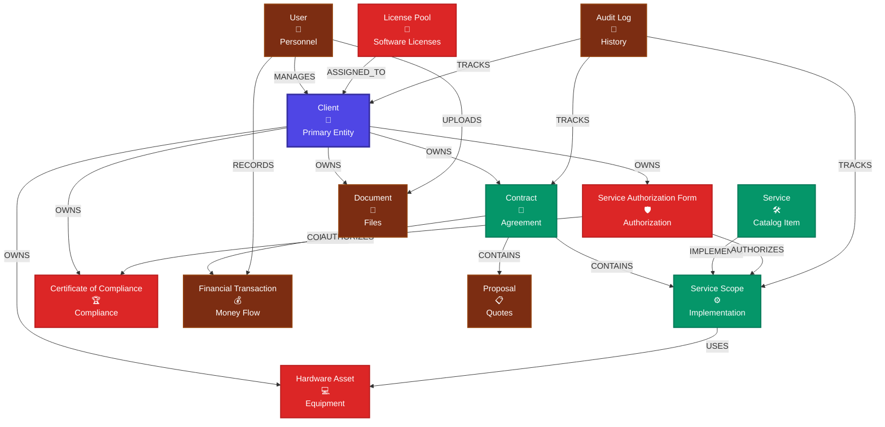

# Entity Relationships System - Visual Architecture

## 📊 **Entity Relationship Diagram**



## 🔄 **Bidirectional Navigation Logic**

### **Forward Relationships (Entity → Related Entities)**
```
Client ─────┐
            ├─→ Contracts (OWNS)
            ├─→ Hardware Assets (OWNS)
            ├─→ SAFs (OWNS)
            ├─→ COCs (OWNS)
            └─→ Documents (OWNS)

Contract ───┐
            ├─→ Service Scopes (CONTAINS)
            ├─→ Proposals (CONTAINS)
            └─→ Financial Transactions (CONTAINS)

SAF ────────┐
            ├─→ COCs (AUTHORIZES)
            └─→ Service Scopes (AUTHORIZES)
```

### **Reverse Relationships (Related Entities → Parent Entity)**
```
Contract ────→ Client (BELONGS_TO)
Service Scope ─→ Contract (PART_OF)
COC ──────────→ SAF (COMPLIES_WITH)
Asset ────────→ Client (ASSIGNED_TO)
```

## 🌳 **Tree View Structure for Client Details**

### **Hierarchical Display Pattern**
```
📁 CLIENT: Acme Corporation
├── 📄 Contracts (3)
│   ├── 📋 2024 Security Services Contract
│   │   ├── ⚙️ Service Scopes (5)
│   │   │   ├── 🛡️ EDR Management
│   │   │   ├── 🔍 SIEM Monitoring
│   │   │   └── 📊 Compliance Reporting
│   │   ├── 📋 Proposals (2)
│   │   └── 💰 Transactions (12)
│   └── 📋 2023 Infrastructure Contract
│       └── ⚙️ Service Scopes (3)
├── 💻 Hardware Assets (8)
│   ├── 🖥️ Dell OptiPlex 7090
│   ├── 💻 HP EliteBook 850
│   └── 🖨️ Canon ImageRunner
├── 🛡️ Service Authorization Forms (4)
│   ├── 📜 SOC2 Authorization
│   │   └── 🏆 SOC2 Certificate (Authorized)
│   └── 📜 PCI DSS Authorization
│       └── 🏆 PCI Certificate (Pending)
├── 📁 Documents (15)
│   ├── 📄 Contract Documents
│   ├── 📋 Compliance Reports
│   └── 📊 Performance Reports
└── 👥 Team Assignments (3)
    ├── 👤 John Smith (Account Manager)
    ├── 👤 Sarah Wilson (Lead Engineer)
    └── 👤 Mike Davis (Security Analyst)
```

## 📊 **Relationship Statistics Display**

### **Visual Indicators in Tree View**
```
Entity Type          Count    Status Distribution    Action Options
─────────────────────────────────────────────────────────────────
📄 Contracts         (3)      ●●○ 2 Active, 1 Draft   [View] [Add] 
⚙️ Service Scopes     (8)      ●●●○ 6 Active, 2 Setup  [View] [Manage]
🛡️ SAFs              (4)      ●●○○ 3 Approved, 1 Draft [View] [Review]
🏆 COCs               (6)      ●●●○ 5 Valid, 1 Expired  [View] [Renew]
💻 Assets             (12)     ●●●● 8 Deployed, 4 Stock [View] [Assign]
💰 Transactions       (24)     ●●●● Recent activity     [View] [Add]
```

## 🔗 **Navigation Features**

### **1. Interactive Links**
- **Click any entity** → Navigate to its detail page
- **Hover tooltips** → Show quick preview information
- **Badge indicators** → Show status, count, health

### **2. Contextual Actions**
- **View Details** → Open full entity page
- **Quick Edit** → Inline editing capabilities  
- **Add Related** → Create new related entities
- **Export** → Generate reports for entity group

### **3. Smart Filtering**
- **Status Filters** → Show only active/inactive items
- **Date Ranges** → Filter by creation/modification dates
- **Search** → Find specific entities within relationships

### **4. Performance Optimization**
- **Lazy Loading** → Load relationship data on demand
- **Caching** → Cache frequently accessed relationships
- **Pagination** → Handle large relationship sets
- **Virtual Scrolling** → Smooth performance with 1000+ items

## 🎯 **Implementation Strategy**

### **Phase 1: Core Tree Structure**
1. Implement basic hierarchical display
2. Add expand/collapse functionality
3. Show entity counts and basic status

### **Phase 2: Interactive Navigation** 
1. Add click-to-navigate functionality
2. Implement hover tooltips with previews
3. Add contextual action menus

### **Phase 3: Advanced Features**
1. Real-time status updates
2. Drag-and-drop relationship management
3. Bulk operations on related entities

### **Phase 4: Performance & UX**
1. Implement virtual scrolling
2. Add progressive loading
3. Enhanced search and filtering

---

**Key Benefits:**
- **🔍 Discovery:** Easily find related entities
- **📊 Visualization:** Understand entity relationships at a glance  
- **⚡ Navigation:** Quick access to related information
- **📈 Insights:** See relationship patterns and health
- **🎯 Efficiency:** Reduce clicks and page loads 